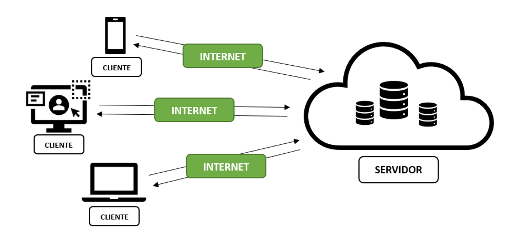

# Fudamentos da programação Web

# Introdução à Programação WEB

---

## O que é programar?

- Codar, Desenvolver, Programar é **resolver problemas do mundo real através das linhas de código**, através de tratamento de dados e com um fluxo de eventos (algoritmo) que segue uma ordem lógica.

---

**Algoritmos** são sequências de passos (fluxo de eventos) que seguem uma ordem lógica para obter um resultado.

**Programas** são conjunto de instruções.

## **Lógica de Programação**

- Lógica de programação é uma maneira de pensar seguindo uma sequência lógica de instruções, seja para construir um programa ou até fazer uma tarefa simples.

### Principais tipos de lógica de programação

### Programação imperativa:

Dar ordens - Seguir passos e sequências - se preocupa com os detalhes.

### Programação declarativa:

Declaração - Conjunto de regras definidas - nem tanto aprofundado.

### Como o computador entende?

O computador não tem capacidade intelectual, ele recebe ordens (instruções) através de linhas de comando (linguagem de programação) e simplesmente processa essas ordens.

---

## Como funciona a Internet (web)?

A internet é uma rede global de computadores interconectados que usam o protocolo TCP/IP para compartilhar informações.

A comunicação na internet é possível graças ao protocolo TCP/IP, que é um conjunto de regras e procedimentos que permitem que os computadores se comuniquem uns com os outros.

Quando um usuário envia uma solicitação de informação, essa solicitação é dividida em pacotes de dados e enviada através da internet para o servidor apropriado. O servidor, por sua vez, envia uma resposta, também dividida em pacotes de dados, de volta ao usuário.

O **TCP (Transmission Control Protocol)** é responsável por garantir que os dados sejam transmitidos de forma precisa e confiável entre os computadores. Ele divide os dados em pacotes e os envia através da internet, garantindo que todos os pacotes cheguem ao destino correto e na ordem correta. Caso haja algum problema com a transmissão, o TCP tentará reenviar os pacotes até que eles cheguem ao destino correto.

O **IP (Internet Protocol**) é responsável por garantir que os pacotes de dados cheguem ao destino correto. Ele atribui um endereço IP único a cada dispositivo conectado à internet e usa esse endereço para encaminhar os pacotes de dados para o destino correto.

### Outros protocolos

Além do TCP e do IP, existem outros protocolos que fazem parte do conjunto TCP/IP. Por exemplo, o protocolo DNS (Domain Name System) é responsável por traduzir os endereços de nomes de domínio, como [www.example.com](http://www.example.com/), para endereços IP, permitindo que os usuários acessem sites com nomes fáceis de lembrar. O protocolo HTTP (Hypertext Transfer Protocol) é usado para transferir dados na World Wide Web.

Em resumo, o protocolo TCP/IP é um conjunto de regras e procedimentos que permitem a comunicação precisa e confiável entre computadores na internet, garantindo que os dados cheguem ao destino correto e na ordem correta. Ele é composto por vários protocolos, como o TCP, o IP, o DNS e o HTTP, que trabalham juntos para garantir que a comunicação entre dispositivos seja eficiente.

---

# Cliente x Servidor

- Cliente - Navegador (Browser)
- Servidor - Computador em algum lugar do mundo que tem os códigos, bancos e arquivos da aplicação.
- Troca de dados (arquivos)
  Cliente faz o pedido e Servidor escuta e responde ao pedido
  Cliente é o front-end, servidor é o back-end

# Front-end e Back-end

Traduzimos como `front` frente e `back` fundo. Existe uma comunicação entre essas duas pontas para que o usuário atinja seu objetivo dentro da aplicação.

`Front-end` é todo código executado do lado do cliente, na máquina do usuário. Aqui estão inclusos arquivos HTML, de estilo CSS, Javascript, exibição de páginas, interfaces.

`Back-end` é todo o código executado no servidor da aplicação. Aqui estão inclusos Bancos de dados e gerenciamento de APIs, por exemplo.

---

## Tecnologias Front-end do Explorer

- **HTML**
  Linguagem de marcação de texto oficial da web.
- **CSS**
  Linguagem de estilo para deixar o HTML bonito
- **JavaScript**
  Linguagem de programação que funciona no navegador.
- **React.js**
  Biblioteca Javascript criada pelo Facebook e muito utilizada no mercado.

---

## Tecnologias Back-end do Explorer

- **Node.js**
  É um conjunto de ferramentas para rodar o Javascript fora do ambiente do navegador (do lado do servidor).
- **SQL**
  Banco de dados para guardar e proteger os dados da aplicação em um lugar único.
