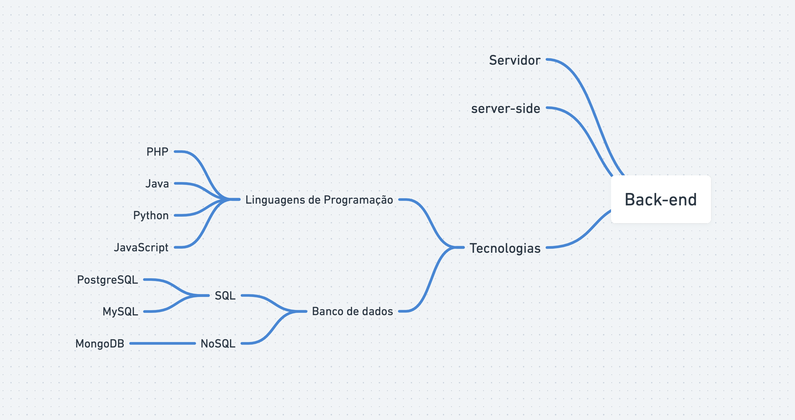

# O que é e como funciona a Web?

### Web: Teia - Rede mundial de computadores.

#### Como funciona a Web

Quando você** digita um endereço no seu navegador** ex: https://rocketseat.com.br, esse **endereço navega até o servidor de DNS** (Domain Name System) e **esse endereço digitado é convertido para um IP** (Internet Protocol). **O client (browser) manda uma requisição HTTP** (Hypertext Transfer Protocol) **para o servidor pedindo uma cópia do site**. **Todos esses são fornecidos através do protocolo TCP** (Transmission Control Protocol). Com todo esse trajeto, você tem uma cópia do site completo em seu navegador.

---

# Front-end X Back-end

**Front-end:**
É a parte visual do nosso site, onde conseguimos ter uma certa interação. Programadores front-end utilizam as tecnologias (HTML, CSS, JavaScript) algumas bibliotecas e frameworks como ReactJS, Angular, Vue e ferramentas (Webpack e Babel)

**Back-end:**
Programadores back-end já trabalham mais do lado do servidor, onde está a regra de negócio. Normalmente é utilizada tecnologias como: NodeJS, PHP, Java, Python e banco de dados (mySQL, PostgreSQL, MongoDB).

