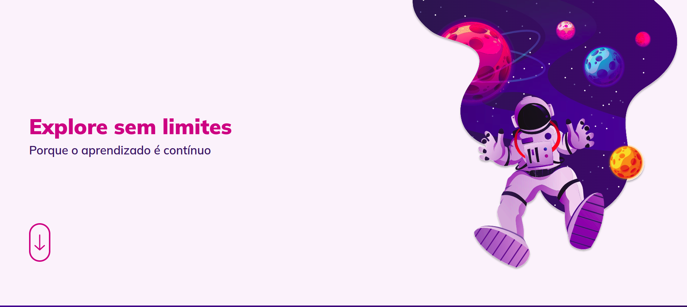
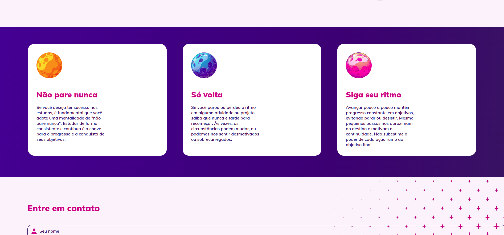
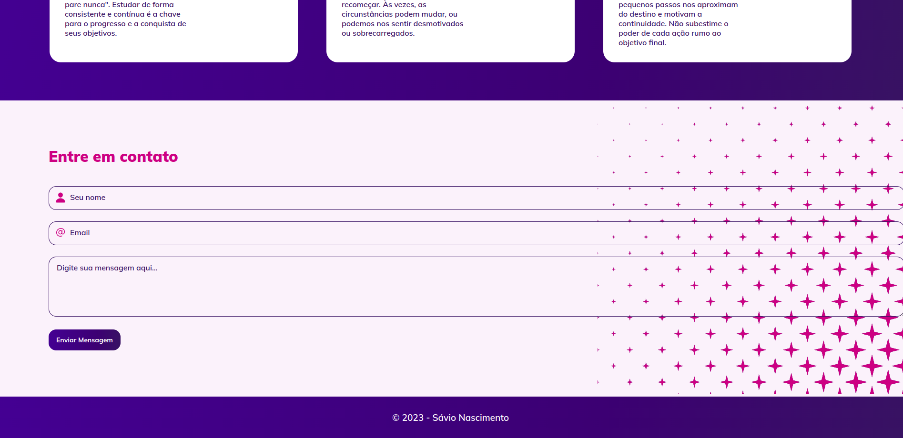
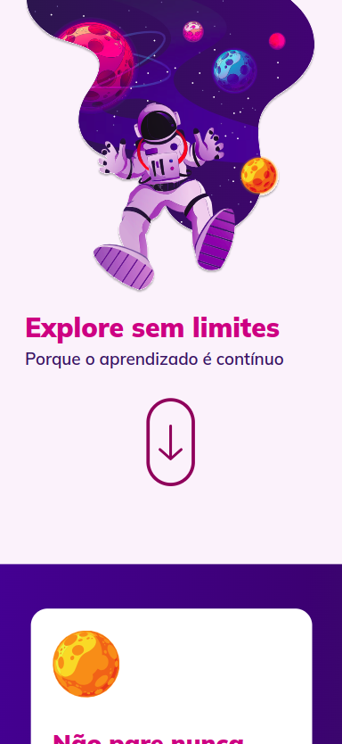
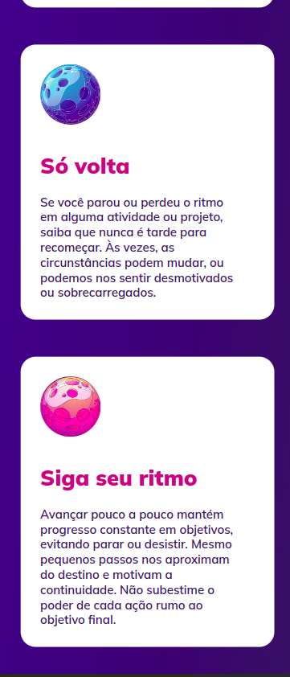
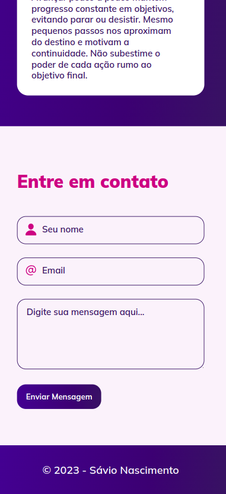

# Desafio - Explore sem limites

[🏠 Home](https://github.com/savionascimentodev/RocketSeat-Explorer)

## 📝 Sobre o desafio

Chegou o momento de colocar a mão na massa e se desafiar com código!
Bora ver o que te espera por aí? 👀

Preparamos pra você um desafio que envolve o máximo de conteúdo visto nos stages iniciais.
Como dito anteriormente, passando pelo quiz e conseguindo reproduzir esse layout, sem grandes dificuldades, você já estará apto para **pular direto para o Stage 05**!
Woooow! Que demais, hein? 💙

A ideia aqui é você recriar esse **[layout](https://www.figma.com/file/563kgHMxsEy17nCdTJI6JC/Explore-sem-limites/duplicate)** mas, diferente dos desafios iniciais que possuem apenas uma tela, esse tem mais de uma seção…

**Pontos importantes e que devem ser pensados durante a construção do projeto:**

- Inicie o seu projeto levando em consideração a regra do mobile first, como você pode ver, no layout já temos a aplicação responsiva também;
- Você pode adicionar animações, transições e transformações a seu critério;
- Seria bacana se já iniciasse o projeto usando as unidades de medida flexíveis (rem);
- Você pode usar variáveis no CSS pra treinar;
- Olhe com carinho para a acessibilidade: cuide da semântica do seu HTML.

---

## 👾 Projeto Finalizado 👾

### Explore Sem Limites 🚀

Projeto criado para o intensivão **Html-Css**

### Desktop Screenshots

---

---

### Mobile Screenshots

---

---

