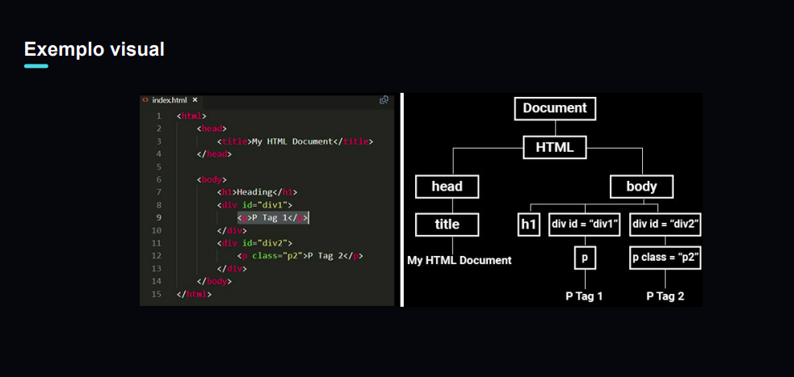

# que é DOM?

DOM significa **Document Object Model**. É uma modelagem do documento como objeto JavaScript, ou seja, uma representação do HTML em objetos JavaScript com atributos (**propriedades**) e métodos (**funcionalidades**).

> O DOM é criado pelo navegador (browser) e é uma interface **(API)** usada no navegador.

## Pra que serve?

O Javascript usa a DOM para se conectar ao HTML.

> DOM não é o Javascript.

- Acessar e modificar o conteúdo de um documento HTML;

- Manipular a estrutura de um documento HTML;

- Aplicar estilos a um documento HTML;

- Adicionar eventos a um documento HTML;

- Criar novos elementos HTML;

## Benefícios do DOM

Permite que os scripts interajam com o conteúdo da página web de forma dinâmica
Facilita a criação de páginas web mais complexas e interativas. Torna o desenvolvimento web mais eficiente



---

## Manipulando elementos

### Element e Node

As tags HTML, quando usadas pela DOM, podemos chamar de `node` (nó) ou de `element` (elemento):

```js
// Pegando um elemento
const h1 = document.querySelector("h1") //HTMLElement
// Pegando vários elementos
const links = document.querySelectorAll("a")
```

### Recebendo e modificando valores

Podemos pegar qualquer valor das tags e alterar eles.

```js
// innerText
console.log(h1.innerText)
// innerHTML
console.log(h1.innerHTML)
// alterando o texto (ou o HTML)
h1.innerText = "Novo título"
```
