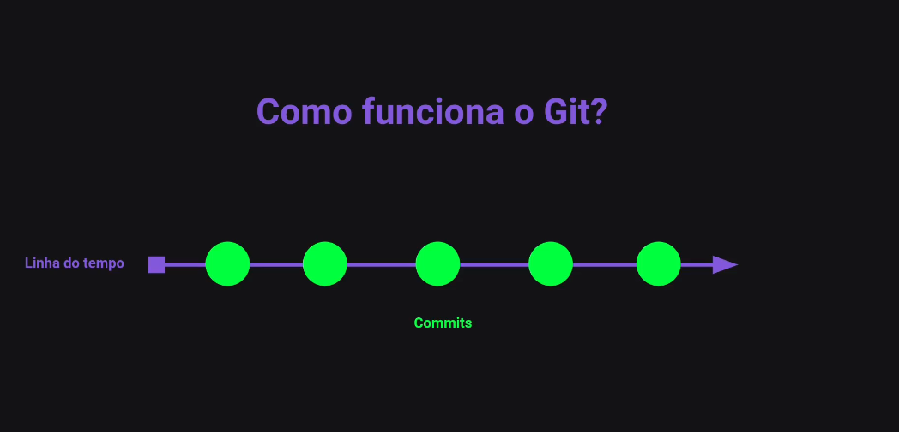

# Git

**O Git é um sistema de controle de versões distribuído e um sistema de gerenciamento de código fonte, com ênfase em velocidade.**
O Git foi inicialmente um projeto projetado para o desenvolvimento do Kernel Linux, mas foi adotado por muitos outros projetos e atualmente é o controlador de versões mais utilizado.

### Como funciona o Git

A linha horizontal representa a **linha do tempo** do projeto e ccada círculo verde representa um **commit**, que é uma captura instantânea do estado do seu projeto em um determinado momento.

#### Commits - cada commit armazena:

- O estado de todos os arquivos do seu projeto naquele momento;
- Uma mensagem que descreve as alterações feitas;
- O nome e o email do autor do commit;

---

# Github

**O GitHub é uma plataforma online que combina o sistema de controle de versão Git com recursos de rede social para desenvolvedores.**

### Funcionalidades:

**Controle de versão:** Armazene e monitore o histórico de alterações do seu código;
**Colaboração:** Trabalhe em projetos com outros desenvolvedores, mesmo que estejam em locais diferentes;
**Comunidade:** Conecte-se com milhões de desenvolvedores de todo o mundo, participe de projetos de código aberto e compartilhe seu conhecimento;
**Gerenciamento de projetos:** Utilize ferramentas para organizar e acompanhar o progresso do seu projeto;
