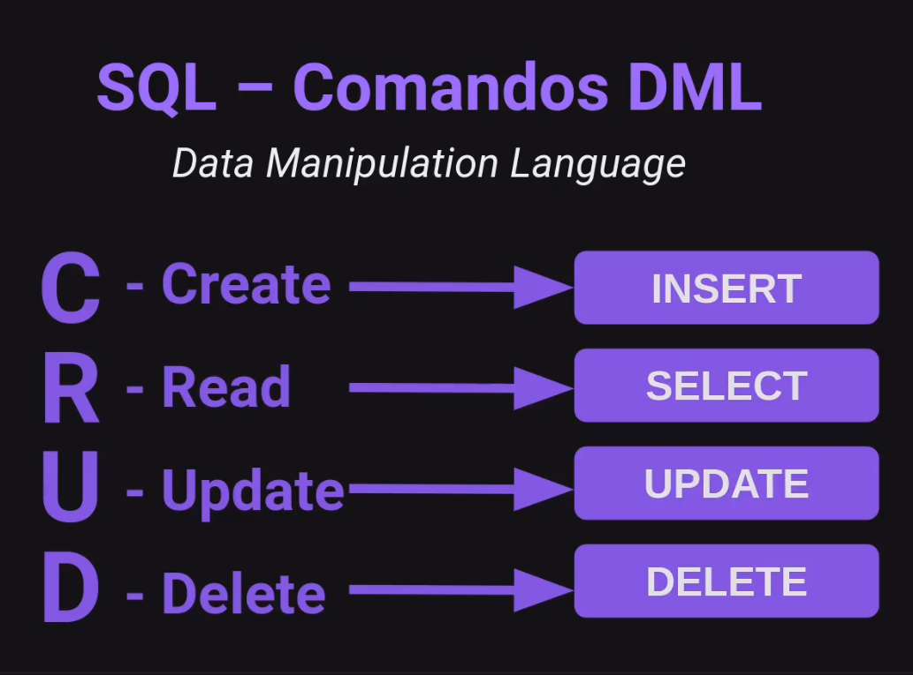

# Banco de Dados

**Um banco de dados é uma coleção organizada de informações estruturadas, normalmente armazenadas eletronicamente em um sistema de computador.**
É um repositório onde dados relacionados são armazenados. Esses dados podem ser informações comerciais, registros de clientes, transações financeiras, registros médicos e muito mais.

### Componentes da Estrutura:

**Banco de dados:** Contém todas as tabelas e seus dados.
**Tabela:** Armazena um conjunto específico de dados, como clientes, produtos ou vendas.
**Coluna:** Representa um tipo específico de dado dentro de uma tabela, como nome, endereço ou preço.
**Linha:** Representa um único registro dentro de uma tabela, como um cliente específico, um produto específico ou uma venda específica.

#### Relacionamentos entre as Tabelas:

**Chave Primária:** Coluna que identifica unicamente cada registro em uma tabela.
**Chave Estrangeira:** Coluna que referencia a chave primária de outra tabela.
Exemplo:

### Exemplo de uma tabela com campos:

---

### SQL

SQL, abreviação de Structured Query Language (Linguagem de Consulta Estruturada), é uma linguagem padrão para gerenciar dados em bancos de dados relacionais.

#### Comandos DML

Data Manipulation Language

- **C** - Create (Criar): usado para criar novas tabelas, bancos de dados, views, etc.
- **R** - Read (Ler): usado para recuperar dados de uma tabela ou várias tabelas.
- **U** - Update (Atualizar): usado para modificar dados existentes em uma tabela.
- **D** - Delete (Excluir): usado para remover dados de uma tabela.

### Migrations

**Migrations são scripts que automatizam a criação e a atualização do schema do seu banco de dados.** Eles permitem que você defina a estrutura do banco de dados de forma declarativa, o que torna o processo mais fácil e eficiente.

#### Vantagens de usar Migrations:

- **Facilidade de uso:** você não precisa escrever manualmente comandos SQL para criar e atualizar o schema do banco de dados.
- **Consistência:** as Migrations garantem que o schema do banco de dados seja sempre consistente com o código da sua aplicação.
- **Controle de versão:** você pode acompanhar as alterações no schema do banco de dados ao longo do tempo.
- **Trabalho em equipe:** as Migrations facilitam o trabalho em equipe, pois permitem que os membros da equipe compartilhem e sincronizem as alterações no schema do banco de dados.
