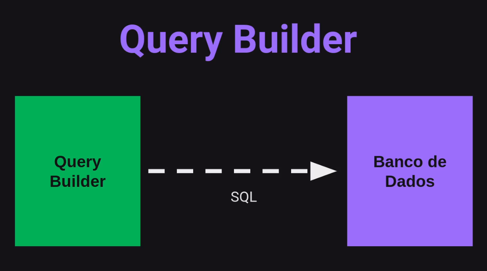
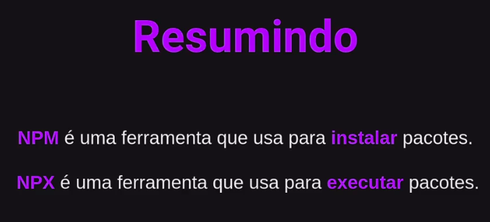

# Query Builder

**Um SQL Query Builder é uma ferramenta que auxilia na construção de consultas SQL de forma visual e intuitiva, sem a necessidade de escrever o código manualmente.**

### Migrations

**É uma forma de versionar a base de dados, trabalham na manipulação da dos dados: criando, alterando ou removendo.**

#### Métodos de uma Migration

- **UP:** Método responsável por criar ou alterar algo no banco de dados.
- **DOWN:** Responsável pelo **rollback**, o 'desfazer' alterações realizadas pela migration;

### NPX Package Runner

> O NPM (Node Package Manager) é o gerenciador de pacotes padrão para o Node.js, os pacotes e módulos necessários no projeto são instalados usando npm;

- O NPX (**Node Package Execute**) e vem com o npm acima da versão 5.2;
- **É um executor de pacotes npm que pode executar qualquer pacote dos registros do NPM sem instalar esse pacote;**

