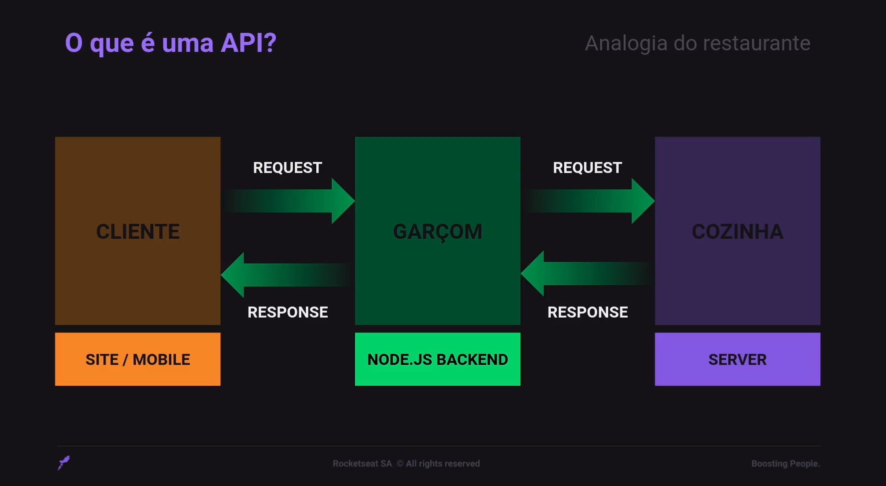
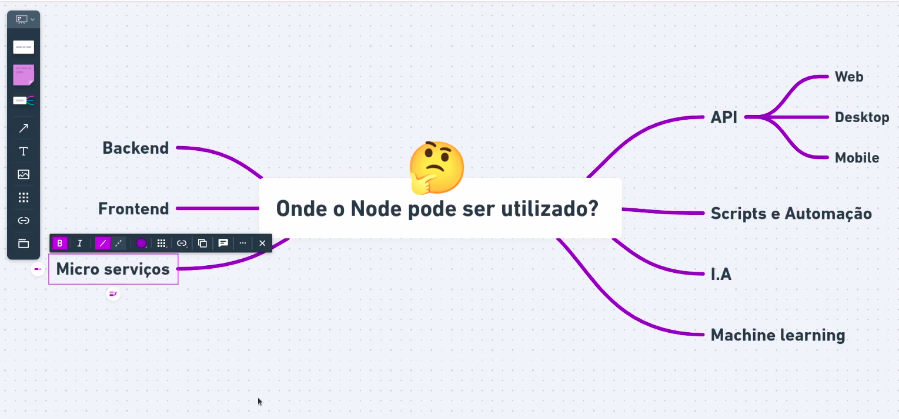
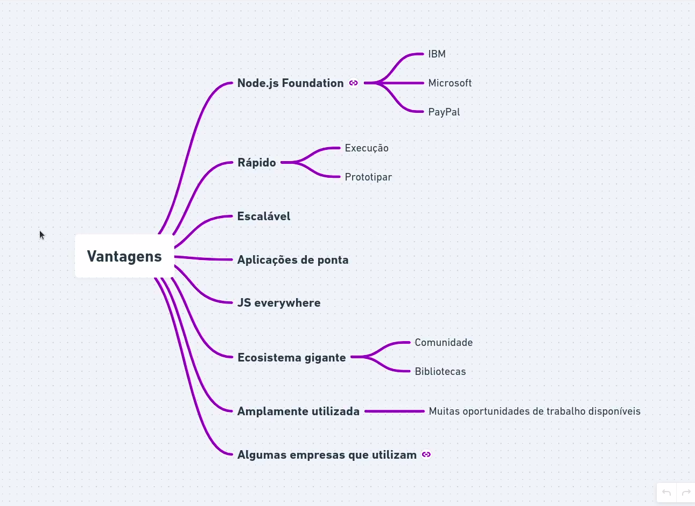
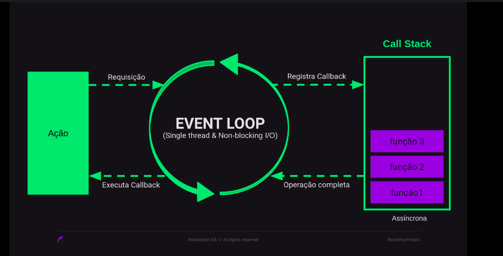

# Conhecendo o Node.js

## O que é uma Api

API - **Aplication Programming Interface**, ou Interface de Programação de Aplicação é um termo para designar uma interface de comunicação que um sistema ofere para que outros acessem suas funções.

## O que é o Node.Js

- Node.js não é uma linguagem de programação.

**Js Runtime Enviroment**

> Ele é um abiente que ofere recursos que permite escrever e executar aplicações Javascript.

- Serve para fazer o que você quiser desde sites à scripts de automação incluindo, a criação de APIS.

## Vantagens

## V8 Engine

**V8 é o interpretador JavaScript**. Desenvolvido pela Google e utilizado em seu navegador Google Chorme.
O v8 foi desenvolvido em C++ com o objetivo de aumentar a performace de execução do JavaScript;

## Funcionamento do Node.js

> O loop é um ciclo contínuo que verifica se há eventos pendentes e os executa. Essa arquitetura permite que o Node.js seja altamente eficiente e escalável, mesmo lidando com um grande número de conexões simultâneas.

### Componentes do Loop de Eventos:

**Fila de Eventos:** Armazena eventos que ainda não foram processados.
**Callback:** Função que é executada quando um evento é concluído.
**Pilha de Chamadas:** Armazena as funções que estão sendo executadas no momento.
**Ação:** Representa a execução de uma função na pilha de chamadas.
Funcionamento do Loop de Eventos:
**Evento:** Uma requisição é recebida pelo servidor Node.js.
**Fila de Eventos:** A requisição é adicionada à fila de eventos.
**Loop de Eventos:** O loop verifica a fila de eventos e encontra a requisição.
**Callback:** Uma função callback é registrada para ser executada quando a requisição for concluída.
**Ação:** A requisição é processada em uma thread única, liberando a thread principal para lidar com outras requisições.
**Callback:** Quando a requisição é concluída, a função callback é executada.
**Pilha de Chamadas:** A função callback é removida da pilha de chamadas.
**Loop de Eventos:** O loop retorna ao início e verifica se há novos eventos na fila.

### Benefícios do Loop de Eventos:

**Eficiência:** Permite que o Node.js lide com um grande número de conexões simultâneas sem bloquear a thread principal.
**Escalabilidade:** O Node.js pode ser facilmente escalado para lidar com um aumento no volume de tráfego.
**Simplicidade:** O modelo de programação assíncrona do Node.js facilita o desenvolvimento de aplicações web escaláveis.
