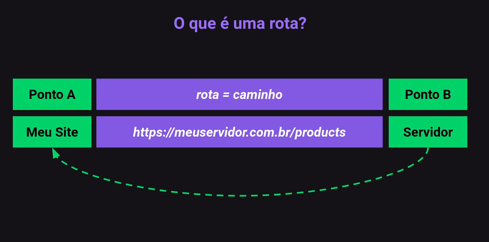
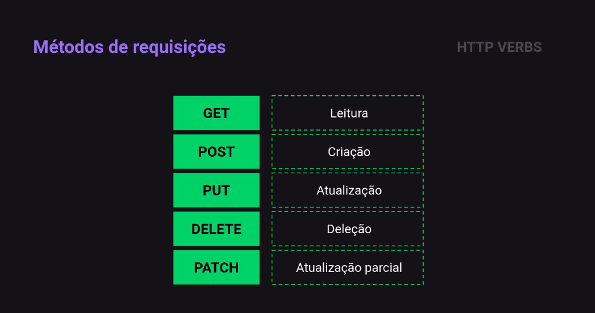
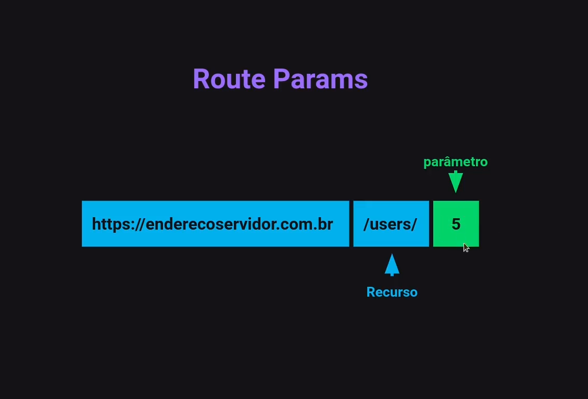
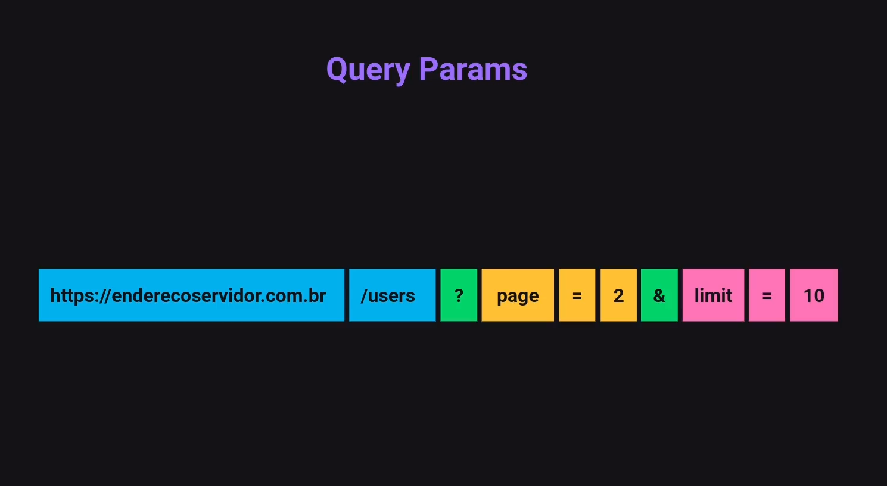
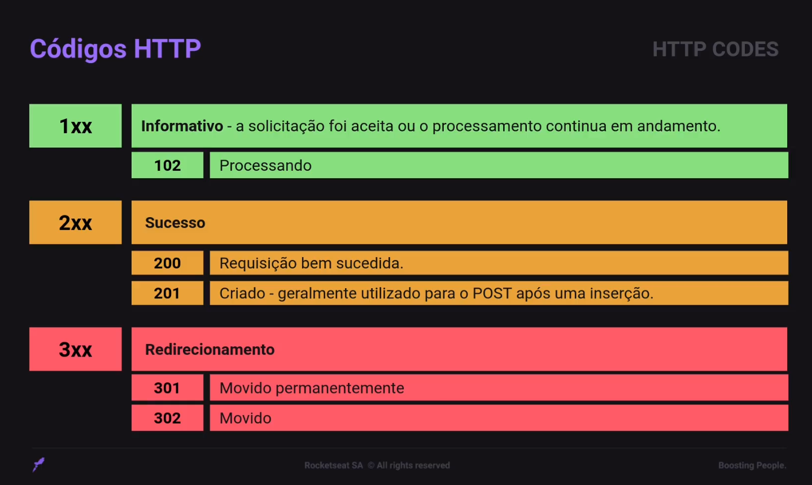
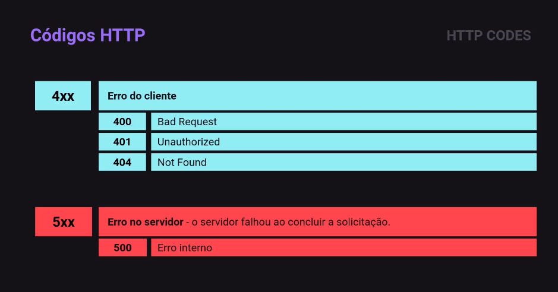
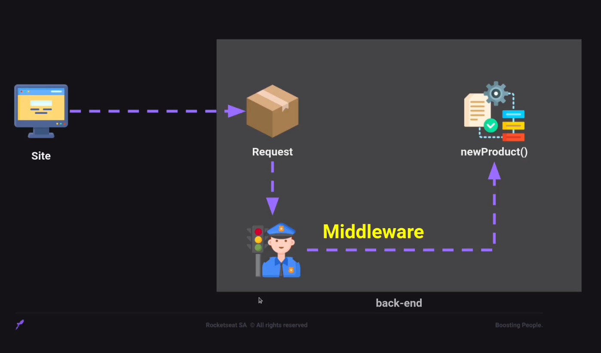

# Rotas

## O que é uma rota?

**As rotas definem o caminho que os usuários tomam para acessar diferentes recursos da aplicação.**

### Componentes das Rotas:

- **URL:** Endereço que o usuário digita no navegador para acessar um recurso específico.
- **Método HTTP:** Indica a ação que o usuário deseja realizar no recurso. Os métodos mais comuns são GET, POST, PUT e DELETE.
- **Controller:** Classe que define a lógica para o tratamento de uma rota específica.
- **Action:** Método dentro do controller que é responsável por executar a lógica para uma rota específica.

## Métodos HTTPS

### Os seis métodos HTTP mais utilizados em aplicações web:

- **GET:** Recupera um recurso do servidor. É o método mais utilizado para acessar páginas web, imagens e outros recursos.

- **POST:** Envia dados para o servidor. É utilizado para criar novos recursos, como usuários, produtos ou pedidos.

- **PUT:** Atualiza um recurso no servidor. É utilizado para modificar dados existentes, como o nome de um usuário ou o preço de um produto.

- **DELETE:** Exclui um recurso do servidor. É utilizado para remover dados que não são mais necessários.

- **PATCH:** Atualiza parcialmente um recurso no servidor. É utilizado para modificar apenas alguns campos de um recurso, sem precisar enviar o recurso completo.

- **OPTIONS:** Obtem informações sobre os métodos HTTP que são suportados por um recurso. É utilizado para verificar quais ações podem ser realizadas em um recurso.

## Route Params

**Parâmetros de rota (Route Params) são uma maneira de capturar valores dinâmicos dentro do caminho de uma URL. Eles são espaços reservados que são substituídos por valores específicos quando uma requisição é feita.**

> São utilizados para informações mais simples como o Id por exemplo.

## Query Params

**Parâmetros de consulta, também conhecidos como "query parameters", são pares de chave-valor anexados ao final de uma URL após um ponto de interrogação (?). Eles são usados para passar informações adicionais para um servidor web ou aplicativo.**

#### Partes de um Parâmetro de Consulta:

- **URL base:** A parte da URL que especifica o recurso ou endpoint.
- **String de consulta: A** parte da URL que começa com um ponto de interrogação ? e contém um ou mais pares de chave-valor.
- **Par chave-valor:** Um par que consiste em uma chave e um valor separados por um sinal de igual (=). A chave é usada para identificar a informação que está sendo passada, e o valor é a informação em si.

> Lembrando que os Query Params são opcionais os Router Params são obrigatórios.

## HTTP CODES

**Estes códigos são emitidos por um servidor em resposta a uma solicitação feita por um cliente.**

### Compreendendo os Códigos:

#### 1xx - Respostas Informativas:

- **102 Processing:** Indica que o servidor está processando a solicitação e que uma resposta final será enviada posteriormente.

#### 2xx - Respostas Bem-Sucedidas:

- **200 OK:** Indica que a solicitação foi bem-sucedida e que o recurso solicitado foi encontrado.
- **201 Created:** Indica que a solicitação foi bem-sucedida e que um novo recurso foi criado.

#### 3xx - Redirecionamentos:

- **301 Moved Permanently:** Indica que o recurso solicitado foi movido permanentemente para outro endereço.
- **302 Found:** Indica que o recurso solicitado foi encontrado temporariamente em outro endereço.

#### 4xx - Erros do Cliente:

- **400 Bad Request:** Indica que a solicitação do cliente está mal formatada ou incompleta.
- **401 Unauthorized:** Indica que o cliente não está autorizado a acessar o recurso solicitado.
- **404 Not Found:** Indica que o recurso solicitado não foi encontrado no servidor.

#### 5xx - Erros do Servidor:

- **500 Internal Server Error:** Indica que um erro inesperado ocorreu no servidor.
- **503 Service Unavailable:** Indica que o servidor está indisponível no momento.

## Middleware

São **funções** que tem **acesso** ao objeto de solicitação (requisição), ele atua como um intermediário, interceptando solicitações e respostas que fluem pelo aplicativo e realizando ações adicionais sobre elas.

> A próxima função middleware é comumente denotada por uma variável chamada next.

### Middlewares Podem:

- Executar qualquer código;
- Fazer mudanças nos objetos de solicitação e resposta;
- Encerrar o ciclo de solicitação-resposta;
- Chamar o próximo middleware na pilha;

> O middleware é uma ferramenta poderosa que pode ser usada para melhorar a funcionalidade, a segurança e o desempenho de aplicativos. Ao usar middleware, os desenvolvedores podem se concentrar na lógica principal do aplicativo e deixar o middleware cuidar de tarefas comuns.
