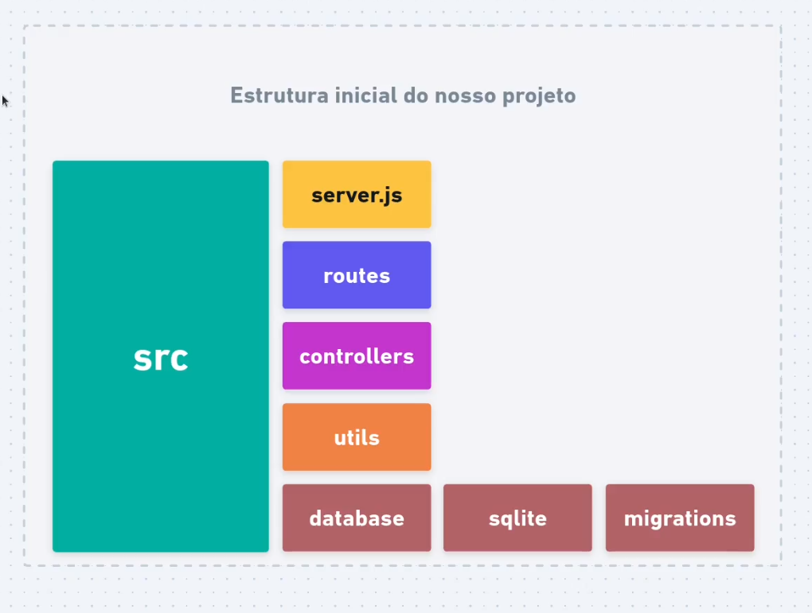

# Projeto Api



## Detalhes

Esse projeto foi feito para entendimento dos conceitos sobre Back-end como:

- Node e Express
- Banco de dados e SQL;
- Rotas e Controllers;
- Migrations;
- Midllewares

O projeto é uma Api básica que cadastra e atualiza os dados de um usuário como: nome, e-mail e senha.

Aprendi conceitos sobre o Node e Express, também como Rotas, Métodos Http, Http Codes, Midllewares, a diferença entre Query Params e Route Params, fiz a conexão com um banco de Dados SQLite, criei uma Migration para automatizar a criação do bd.

#### Colinha com alguns conceitos:

```js
// Importando o express para o projeto;
const express = require("express")

// É preciso inicializar o express;
const app = express()

// Configura o aplicativo Express para interpretar automaticamente os corpos das requisições como dados JSON;
app.use(express.json())

// Definindo a porta que o app irá ficar escutando quando o express foi inicializado;
const PORT = 3333
app.listen(PORT, () => console.log(`Server is running on Port ${PORT}`))

// Utilizando o método HTTP Get, primeiro colocando o endereço da rota, e seus dois parâmetros requisição e resposta;
app.get("/test/:id/:user", (request, response) => {
  const { id, user } = request.params

  // Pegando os paremetros que estão vindo na rota (Route Params);
  response.send(
    `O Id que está vindo é: ${request.params.id} e o  nome que está vindo é: ${request.params.user}`
  )
})

// Utilizando o (Query Params) lembrando que eles são opcionais os (Router Params) são obrigatórios
app.get("/users", (req, res) => {
  const { page, limit } = req.query

  res.send(`Página: ${page}. Mostrar: ${limit}`)
})

// Utilizando o método HTTP Post, enviando name, email e password pelo body;
app.post("/users", (request, response) => {
  const { name, email, password } = request.body

  response.json({ name, email, password })
})
```
