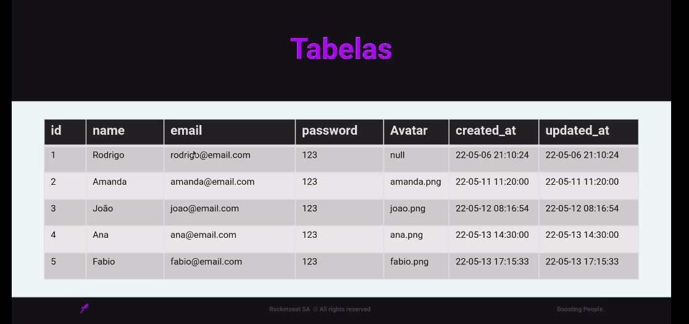
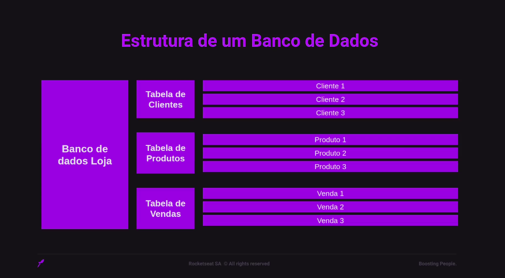

# Banco de Dados

**Um banco de dados é uma coleção organizada de informações estruturadas, normalmente armazenadas eletronicamente em um sistema de computador.**
É um repositório onde dados relacionados são armazenados. Esses dados podem ser informações comerciais, registros de clientes, transações financeiras, registros médicos e muito mais.

### Componentes da Estrutura:

**Banco de dados:** Contém todas as tabelas e seus dados.
**Tabela:** Armazena um conjunto específico de dados, como clientes, produtos ou vendas.
**Coluna:** Representa um tipo específico de dado dentro de uma tabela, como nome, endereço ou preço.
**Linha:** Representa um único registro dentro de uma tabela, como um cliente específico, um produto específico ou uma venda específica.

#### Relacionamentos entre as Tabelas:

**Chave Primária:** Coluna que identifica unicamente cada registro em uma tabela.
**Chave Estrangeira:** Coluna que referencia a chave primária de outra tabela.
Exemplo:

### Exemplo de uma tabela com campos:

