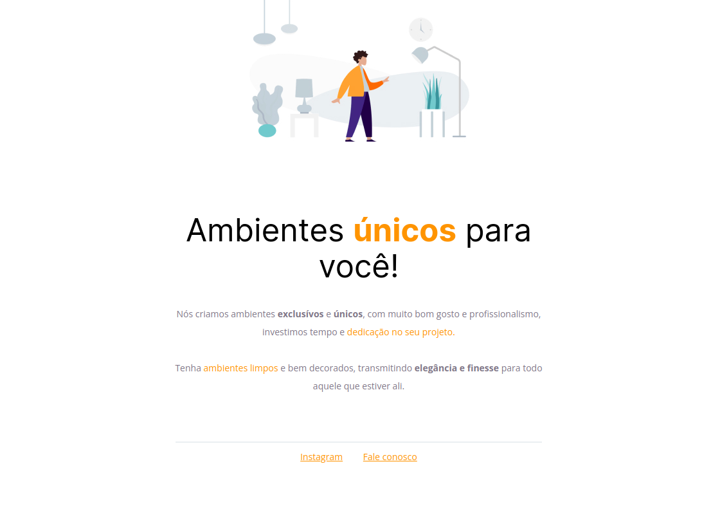
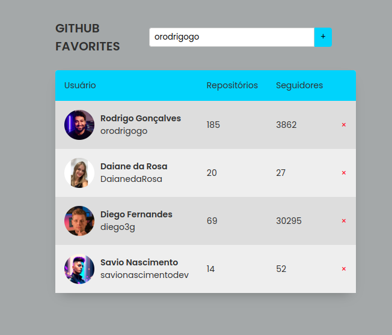

<h1 align="center">
   Rocketseat Explorer 
</h1>

<h3 align="center">

    
   

</h3>

  <a href="#Sobre">Sobre</a> |
  <a href="#projects">Projetos</a> |
  <a href="#-Desafios">Desafios</a> |
  <a href="#author">Autor</a>

---

<!-- [🏠 Home](https://github.com/savionascimentodev) -->

## 📚 Sobre

<a class="#Sobre"/>

---

## 👾 Projetos

### Stage 02 - Móveis Customizados

  

[Projeto feito](https://github.com/savionascimentodev/RocketSeat-Explorer/tree/main/06-JavaScript-Antes-Do-Framework/Projeto-Github-Favorites) em Html e Css puro, feito com base em um design do [Figma](https://www.figma.com/file/fAvYZz4dPV5MfhL77XkqkD/Explorer---Projeto-01/duplicate), aprendi sobre conceitos básicos de css como espaçamentos bordas e também como utilizar o Figma.

### Stage 4.1 - Intensivão

O Intensivão é um projeto de aceleração que foi criado para ajudar pessoas que precisam acelerar a jornada e querem rever os níveis iniciais de uma forma mais rápida, sem deixar de testar e aplicar o seu conhecimento.

**Existe dois Desafios nesse stage:**

- Layout;
- JavaScript;

Veja mais sobre os desafios/projetos feitos [aqui](https://github.com/savionascimentodev/RocketSeat-Explorer/tree/main/04.1-Intensivao-Projeto). **PS**: Veja os Readmes dos desafios.

### Stage 06 - GitHub Favorites

  

[Projeto feito](https://github.com/savionascimentodev/RocketSeat-Explorer/tree/main/06-JavaScript-Antes-Do-Framework/Projeto-Github-Favorites) em Js puro utilizando **classes**, programação **funcional**, **dom**, utilizando a **API** de usuários do Github para trazer os dados em uma listagem, utilizando o **fetch** e **async/await** para as **promises**, salvando os dados com o **local storage**, não permite favoritar usuários já listados e também pode remover um usuário.

---

### 👤 Autor 

### [Savio Nascimento](https://github.com/renyzeraa)

🛠 `Full Stack Developer Jr`
📍 Nova Mutum - Brazil

 

 

---

  

 

[⬆️ Topo](#top)  
