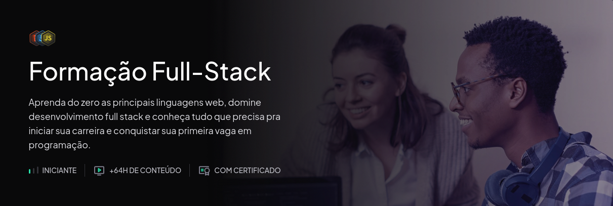

<h1 align="center">
   Rocketseat Explorer 
</h1>

<h3 align="center">

       

</h3>

  <a href="#Sobre">Sobre</a> |
  <a href="#projects">Projetos</a> |
  <a href="#-Desafios">Desafios</a> |
  <a href="#author">Autor</a>

---

<!-- [🏠 Home](https://github.com/savionascimentodev) -->

## 📚 Sobre

<a class="#Sobre"/>

---

<!-- ## 👾 Projetos 

### ❌⭕ Tic Tac Toe

Projeto feito com **Vue.js**(composition api) e **TailwindCss**, que consiste em um jogo da velha de dois jogadores, veja o projeto aqui: [Projeto](https://projetos-vue-js.vercel.app/), para saber mais sobre o projeto veja o [Readme](https://github.com/savionascimentodev/Projetos-VueJs/tree/main/tic-tac-toe) dele.

### 💰💰 Api Coin

Projeto feito com **Vue.js** e **SpectreCss**, que consiste em uma listagem de uma API de cotação de moerdas, veja o projeto aqui: [Projeto](https://projetos-vue-js-api-coin.vercel.app/), para saber mais sobre o projeto veja o [Readme](https://github.com/savionascimentodev/Projetos-VueJs/tree/main/api-coin) dele.

--- -->

### 👤 Autor 

**Sávio Nascimento**

- 
- 

---

  

 

[⬆️ Topo](#top)  
